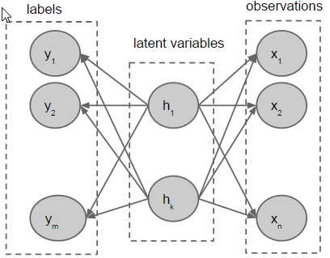
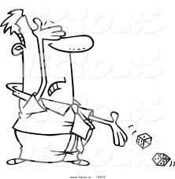
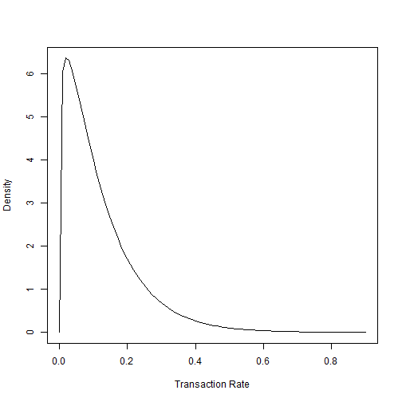
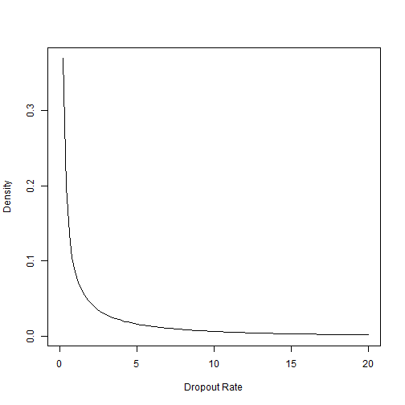

Going Beyond RFM - CLV Prediction
========================================================
author: Ashish Kulkarni
date: 

Introduction
========================================================
<b>Customer Lifetime Value (CLV):</b> Present value of the future cash flows associated with a customer.

- Some of the earlier work computed <i>customer profitability</i> based on their prior behavior.
- But CLV is all about looking into the future, not the past.
- This requires us to accurately <i>model</i> for future revenues and user fallout.

A Stochastic Modeling Approach
========================================================


- Observations are a realization of latent traits
- Use Bayes' theorem to estimate a user's latent traits as a function of observations
- Then predict future behavior as a function of these latent traits

CLV Prediction using RFM
========================================================
Assumes monetary value to be independent of the underlying transaction process.

$$CLV = margin \times revenue/transaction \times DET$$

where, DET (Discounted Expected Transactions) is the present value of the future transaction flow.

Next, we develop the model to predict discounted expected number of transactions.

Predicting Expected Number of Transactions
========================================================
<br/>
             
Predicting expected number of transactions for a user involves simulation of two events -


***

- User survival (or churn): think coin toss
- Number of transactions done while the user is active: think dice roll

Model for DET prediction - The Pareto/NBD Model
========================================================
<small>
Based on five assuptions:

- While active, the number of transactions made by a user in a time period $t$ follows a Poisson distribution with transaction rate $\lambda$.
- Heterogeneity in transaction rates across users follows a gamma distribution with shape parameter $r$ and scale parameter $\alpha$.
- Each user has an unobserved ``lifetime'' $\tau$. This point at which the user churns is distributed exponentially with dropout rate $\mu$.
- The prior on dropout rate follows a gamma distribution with shape parameter $s$ and scale parameter $\beta$.
- The transaction rate $\lambda$ and dropout rate $\mu$ vary independently across customers.
</small>

Model Development
========================================================
<small>
Requires only two pieces of input about each user's past purchasing history:
- recency: time from now of occurrence of last transaction
- frequency: number of transactions made during a specified time period

This is expressed using the notation $(X = x, t_x, T)$, where $x$ is the number of observed transactions in the time period $(0, T]$ and $t_x (0 < t_x \leq T)$, is the time of last transaction.

$$DET(\delta|r,\alpha,s,\beta,X=x,t_x,T) = \frac{\alpha^r\beta^s\delta^{s-1}\Gamma(r+x+1)\Psi[s,s;\delta(\beta+T)]}{\Gamma(r)(\alpha+T)^{r+x+1}L(r,\alpha,s,\beta|X=x,t_x,T)}$$
where, $r,\alpha,s,\beta$ are the model parameters, $\Psi(.)$ is the confluent hypergeometric function of the second kind; $\delta$ is the continuously compounded rate of interest and $L(.)$ is the Pareto/NBD likelihood function.
</small>

Comments about Pareto/NBD Model
========================================================
<small>
- The Pareto/NBD model does quite well in modeling the user behavior.
- The emperical performance of the model is excellent and well proven. However, the model suffers from the following drawbacks.
- The likelihood function associated with the Pareto/NBD model is quite complex, involving numerous evaluations of the Gaussian hypergeometric function.
- Multiple evaluations of the Gaussian hypergeometric function are compuatationally intensive.
</small>

Model for DET Prediction - BG/NBD Model
========================================================
<small>
Based on following five assumptions:
- While active, the number of transactions made by a user follows a Poisson distribution with transaction rate $\lambda$.
- Heterogeneity in $\lambda$ follows a gamma distribution with shape parameter $r$ and scale parameter $\alpha$.
- After any transaction, a user becomes inactive with probability $p$, so, $P$(inactive immediately after $j^{th}$ transaction) $= p(1-p)^{j-1}, j = 1,2,3,...$.
- Heterogeneity in $p$ follows a beta distribution, $p \sim Beta(a,b)$.
- The transaction rate $\lambda$ and churn probability $p$ vary independently across users.
</small>

Model Development
========================================================
<small>
Likelihood function for a randomly chosen user with purchase history $(X=x,t_x,T)$
$$
  \begin{aligned}
  L(r,\alpha,a,b|X=x,t_x,T) &= \frac{B(a,b+x)}{B(a,b)}\frac{\Gamma(r+x)\alpha^r}{\Gamma(r)(\alpha+T)^{r+x}} \\ 
  &+ \delta_{x>0}\frac{B(a+1,b+x-1)}{B(a,b)}\frac{\Gamma(r+x)\alpha^r}{\Gamma(r)(\alpha+t_x)^{r+x}}
  \end{aligned}
$$
The model parameters can be estimated using maximum likelihood estimation. For a sample of $N$ users, where user $i$ had $X_i=x_i$ transactions in the period $(0,T_i]$, with recency $t_{x_i}$, the sample log likelihood is given as:
$$LL(r,\alpha,a,b) = \sum_{i=1}^N ln[L(r,\alpha,a,b|X_i=x_i,t_{x_i},T_i)]$$
This can be maximized using standard numerical optimization routines
</small>

Expression for DET prediction
========================================================
<small>
$$
  \begin{aligned}
  E[Y(t)|X &= x,t_x,T,r,\alpha,a,b] = \\
   &\frac{\frac{a+b+x-1}{a-1}[1-(\frac{\alpha+T}{\alpha+T+t})^{r+x} {}_{2}F_{1}(r+x,b+x;a+b+x-1;\frac{t}{\alpha+T+t})]}{1+\delta_{x>0}\frac{a}{b+x-1}(\frac{\alpha+T}{\alpha+t_x})^{r+x}}
  \end{aligned}
$$

- Requires single evaluation of the Gaussian hypergeometric function for any user. Remainder of the expression is simple arithmetic.
- Thus compared to Pareto/NBD, BG/NBD is computationally efficient.
- Performance of this model is almost at-par with the Pareto/NBD model.
</small>

Data Preparation: Query
=========================================================
- For the merchant of interest and for a given period <t1, t2>, query for transactions for each user
- Compute the following:
- Recency (R): Difference between the date of last transaction done by user and the end of period
- Frequency (F): Number of transactions done by the user during the period
- Monetary Valur (M): Average spending amount
- Date of first transaction (start)
- Date of last transaction (end)

Data Preparation: Customer-by-sufficient-statistic (CBS)
==========================================================
For the DET model, we use 
- Recency (R)
- Frequency (F)
- Period of observation: Difference between date of first transaction (start) and the end of period (t2)
- Create a CBS matrix where a row corresponds to each user and the columns correspond to each of the values above

DET Model: Dataset
=====================================================================
- Bank transactions done at Dillards during the period 2014-01-01 through 2014-12-31 are used for training the DET model
- Bank transactions done at Dillards duging the period 2015-01-01 through 2015-03-31 are used for model validation
- Gather sufficient statistic from training/validation data, where, sufficient statistic is frequency of transaction, recency and total time observed for each user.
- Training size: 473,356
- Validation size: 151,772

DET Model: Parameters
====================================================================
MLE estimation of Pareto/NBD model params, trained using a 50,000 training sample
- $r$, shape param for transaction rate Gamma distribution: 1.205
- $\alpha$, scale param for transaction rate Gamma distribution: 9.945
- $s$, shape param for dropout rate Gamma distribution: 0.121
- $\beta$, scale param for dropout rate Gamma distribution: 0.061

DET Model: Transaction Rate heterogeneity
===================================================================
 

DET Model: Dropout Rate heterogeneity
===================================================================
 

DET Model: Model Evaluation on Validation Set
===================================================================


```
Error in file(file, "rt") : cannot open the connection
```
